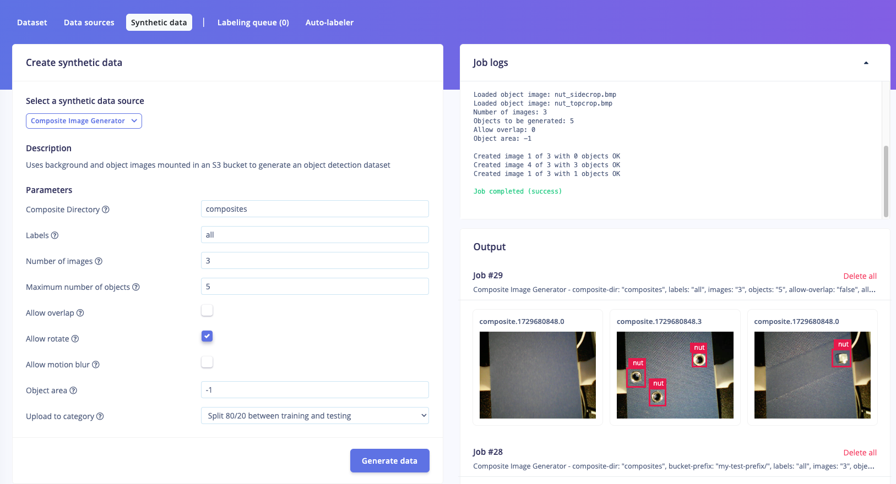

# Composite Image Generation Block for Edge Impulse

This is a transformation block that generates synthetic data for your Edge Impulse project by compositing background images with randomly placed object images (with transparency). It uses the method described in this tutorial: https://github.com/edgeimpulse/conveyor-counting-data-synthesis-demo. To add new object images and background images store them in the composites folder and use the following command to upload to the block: 
```
$ edge-impulse-blocks push
```

from within this folder

## How to run (Edge Impulse)

### Using the Synthetic Data feature (professional & enterprise)

The Studio now has a feature for interacting with Synthetic Data directly from the Studio; and this composite image generation block is available there.

1. Go to a Professional or Enterprise project, choose **Data acquisition > Synthetic data**.
2. Select the 'Composite Image Generator' block, fill in your parameters, and hit *Generate data*.
3. Your synthetic data will show on the right side, for quick evaluation of your parameters.



## Understanding the Parameters:

The following parameters are used in the `parameters.json` file to configure the UI. There are a number of options for image processing and transformation tasks:

### Composite Parameters

- **Composite Directory**
  - **Description**: The folder where the source composite images are found. This folder should contain `background` and `object` subfolders.
  - **Type**: `string`
  - **Default Value**: `composites`
  - **Parameter**: `composite-dir`

- **Labels**
  - **Description**: A comma-separated list of objects to generate images for. Set to `all` to generate images for all objects.
  - **Type**: `string`
  - **Default Value**: `all`
  - **Parameter**: `labels`

- **Number of Images**
  - **Description**: The number of images to generate.
  - **Type**: `int`
  - **Default Value**: `10`
  - **Parameter**: `images`

- **Object Area**
  - **Description**: The coordinates (x1, y1, x2, y2) of the valid area to place objects in the composite image, or `-1` for the whole image.
  - **Type**: `string`
  - **Default Value**: `-1`
  - **Parameter**: `object-area`

- **Maximum Number of Objects**
  - **Description**: The maximum number of objects to generate in each image.
  - **Type**: `int`
  - **Default Value**: `5`
  - **Parameter**: `objects`

- **Allow Overlap**
  - **Description**: Whether objects are allowed to overlap.
  - **Type**: `boolean`
  - **Default Value**: `false`
  - **Parameter**: `allow-overlap`

- **Allow Rotate**
  - **Description**: Whether to apply random rotation to objects.
  - **Type**: `boolean`
  - **Default Value**: `true`
  - **Parameter**: `allow-rotate`

### Image Effects

- **Apply Motion Blur?**
  - **Description**: Whether to apply blur to objects to simulate motion.
  - **Type**: `boolean`
  - **Default Value**: `false`
  - **Parameter**: `apply-motion-blur`

- **Motion Blur Direction**
  - **Description**: The direction to apply blur to objects to simulate motion (`-1` for random).
  - **Type**: `int`
  - **Default Value**: `-90`
  - **Parameter**: `motion-blur-direction`
  - **Show If**: `apply-motion-blur` is `true`

- **Apply Fisheye Lens Effect**
  - **Description**: Whether to apply fisheye lens effect to the final images.
  - **Type**: `boolean`
  - **Default Value**: `false`
  - **Parameter**: `apply-fisheye`

- **Apply Fisheye Lens Effect to All Layers**
  - **Description**: Whether to apply fisheye lens effect to all layers or just to the objects (in case your background images are already fisheyed).
  - **Type**: `boolean`
  - **Default Value**: `true`
  - **Parameter**: `apply-fisheye-all-layers`
  - **Show If**: `apply-fisheye` is `true`

- **Fisheye Lens Effect Strength**
  - **Description**: The strength of the fisheye lens effect.
  - **Type**: `float`
  - **Default Value**: `0.5`
  - **Parameter**: `fisheye-strength`
  - **Show If**: `apply-fisheye` is `true`

- **Crop to Fisheye?**
  - **Description**: Whether to crop the image to remove black borders after applying fisheye lens effect.
  - **Type**: `boolean`
  - **Default Value**: `true`
  - **Parameter**: `crop-fisheye`
  - **Show If**: `apply-fisheye` is `true`

### Upload Parameters

- **Upload to Category**
  - **Description**: The category to upload data to in Edge Impulse.
  - **Type**: `select`
  - **Default Value**: `split`
  - **Parameter**: `upload-category`
  - **Options**:
    - `split`: Split 80/20 between training and testing
    - `training`: Training
    - `testing`: Testing

### Customizing this repository (enterprise only)

You can modify this repository and push it as a new custom Synthetic Data transformation block.

1. Install the [Edge Impulse CLI](https://docs.edgeimpulse.com/docs/tools/edge-impulse-cli).
2. Open a command prompt or terminal, and navigate to this folder.
3. Create a new transformation block:

    ```
    $ edge-impulse-blocks init

    ? Choose a type of block: Transformation block
    ? Choose an option: Create a new block
    ? Enter the name of your block: Custom Composite Image Generator
    ? Enter the description of your block: Generate images by compositing background and object images.
    ? What type of data does this block operate on? Standalone (runs the container, but no files / data items passed in)
    ? Which buckets do you want to mount into this block (will be mounted under /mnt/s3fs/BUCKET_NAME, you can change these mount points in the Studio)?
    ? Would you like to download and load the example repository? no
    ```

4. Push the block:

    ```
    $ edge-impulse-blocks push
    ```

5. To show this block in Synthetic Data:
    1. Go to your Edge Impulse organization.
    2. Choose **Custom blocks > Transformation**, find your new block, click the three dots, and select *Edit transformation block*.
    3. Enable 'Show in Synthetic data':

        

    4. Save the block.

6. You can now access your modified block from **Data acquisition > Synthetic data** on any enterprise project.

## How to run (locally)

1. Install the dependencies:

    ```
    pip3 install -r requirements.txt
    ```

2. Run the generate script:

    ```
    EI_PROJECT_API_KEY=ei_034... python3 transform.py --composite-dir composites --labels "all" --images 3 --objects 5 --allow-overlap 1 --allow-rotate 1 --allow-motion-blur 1 --motion-blur-direction -1 --object-area "0,0,100,100"
    ```

    > Replace replace `ei_034...` with your Edge Impulse API Key (**Dashboard > Keys**).

3. Output is stored both in `output/` and uploaded to your Edge Impulse project.

## --synthetic-data-job-id argument / x-synthetic-data-job-id header

If you want to build your own custom Synthetic Data block, you'll need to parse the (optional) `--synthetic-data-job-id` argument. When uploading data to the ingestion service you need to then pass the value from this argument to the `x-synthetic-data-job-id` header. transform.py implements this. This is required so we know which job generated what data, and is used to render the UI on the Synthetic Data page.
